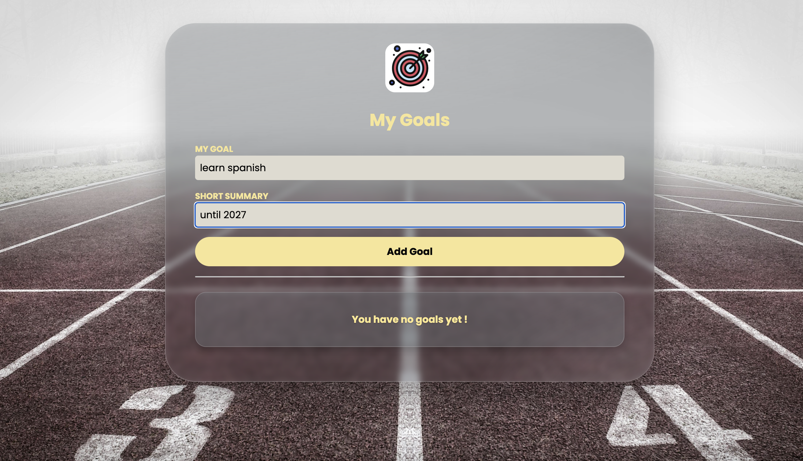
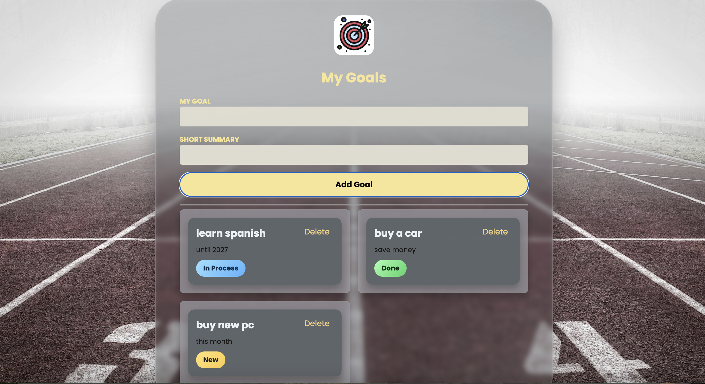
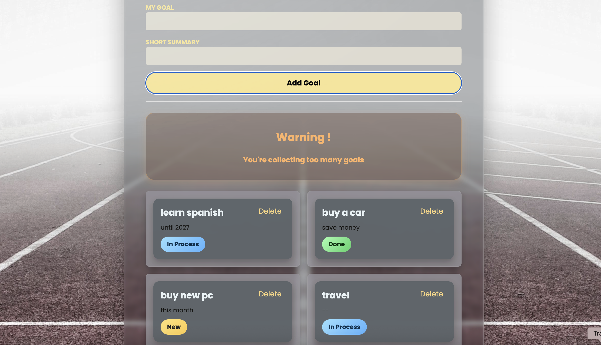

# 🎯 Goals Tracker (React + TypeScript)

A simple, clean goal-tracking app built with React + TypeScript.  
You can add new goals, delete them, and change their status through a 3-stage progress cycle.

---
## Run locally 
bash 

npm install
npm run dev

## 🚀 Features

- ➕ Add goals with title & summary
- 🔄 Status cycle: **New → In Process → Done**
- ❌ Delete goals
- 💡 Hint box when no goals exist
- ⚠️ Warning box when too many goals are added
- 🎨 Clean UI, fully typed with TypeScript
- 🧱 Reusable components + discriminated unions

---

## 📸 Screenshots

### ➕ Adding a Goal


### 🔄 Changing Goal Status


### ⚠️ Warning Display


---

## 🧰 Tech Stack

| Category | Tech |
|----------|------|
| UI       | React + TypeScript |
| State    | useState, useRef |
| Build    | Vite |
| Styling  | CSS |
| Language | TypeScript |

---

## 📂 Project Structure

```txt
src/
├── components/
│   ├── CourseGoal.tsx
│   ├── GoalList.tsx
│   ├── NewGoal.tsx
│   ├── InfoBox.tsx
│   └── Header.tsx
├── images/
│   └── logo.jpg
├── App.tsx
├── main.tsx
└─
